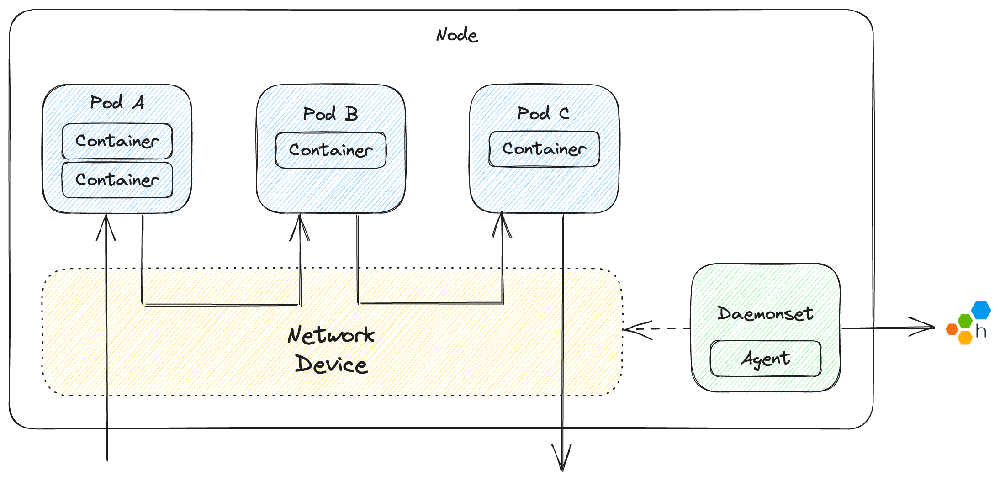

# Honeycomb Network Agent for Kubernetes

[](https://github.com/honeycombio/home/blob/main/honeycomb-oss-lifecycle-and-practices.md)

The Honeycomb Network Agent is a low effort, no-code, language agnostic solution to getting telemetry of your applications running in Kubernetes.

Docker images are found in [`ghcr.io/honeycombio/network-agent:latest`](https://github.com/honeycombio/honeycomb-network-agent/pkgs/container/network-agent).

See notes on local development in [`DEVELOPING.md`](./DEVELOPING.md)

## How it Works

The agent runs as a [`DaemonSet`](https://kubernetes.io/docs/concepts/workloads/controllers/daemonset/) on each node in a Kubernetes cluster.
It captures raw network packets from the network interface that is shared by all resources on the node (Pods, Daemonsets, etc).
Captured network packets are reassembled into whole payloads and then parsed into known application level formats (eg HTTP).
Parsed payloads are converted into events and then sent to Honeycomb.

Events include network level information such as source & destination IPs and port numbers, kubernetes information such as source and destination Pod names, and application level format specific information such as HTTP method and response status code.



The agent generates events per Kubernetes host by inspecting network traffic, in the perspective of either the receiving or sending process.
This results in events being generated in the following scenarios:
- External to pod (cluster ingress)
- Pod to pod
- Pod to Service
- Pod to external (cluster egress)

**NOTE**: For pod-to-pod interactions when each pod is on seperate Kubernetes nodes, two events will be created.

## Getting Started (Quickstart)

### Requirements

- A running Kubernetes cluster (see [Supported Platforms](#supported-platforms))
- A Honeycomb API Key

### Setup

Create Honeycomb namespace for the agent to run in:

```sh
kubectl create namespace honeycomb
```

Create Honeycomb secret for `HONEYCOMB_API_KEY` environment variable so it can be passed into the agent:

```sh
export HONEYCOMB_API_KEY=mykey
kubectl create secret generic honeycomb --from-literal=api-key=$HONEYCOMB_API_KEY --namespace=honeycomb
```

### Configuration

The network agent can be configured using the following environment variables.

| Environment Variable      | Description                                                                              | Default                    | Required? |
| ------------------------- | ---------------------------------------------------------------------------------------- | -------------------------- | --------- |
| `HONEYCOMB_API_KEY`       | The Honeycomb API key used when sending events                                           | `` (empty)                 | **Yes**   |
| `HONEYCOMB_API_ENDPOINT`  | The endpoint to send events to                                                           | `https://api.honeycomb.io` | No        |
| `HONEYCOMB_DATASET`       | Dataset where network events are stored                                                  | `hny-network-agent`        | No        |
| `HONEYCOMB_STATS_DATASET` | Dataset where operational statistics for the network agent are stored                    | `hny-network-agent-stats`  | No        |
| `LOG_LEVEL`               | The log level to use when printing logs to console                                       | `INFO`                     | No        |
| `DEBUG`                   | Runs the agent in debug mode including enabling a profiling endpoint using Debug Address | `false`                    | No        |
| `DEBUG_ADDRESS`           | The endpoint to listen to when running the profile endpoint                              | `localhost:6060`           | No        |
| `ADDITIONAL_ATTRIBUTES`   | Extra attributes to include on all events                                                | `` (empty)                 | No        |
| `INCLUDE_REQUEST_URL`     | Include the request URL in events                                                        | `true`                     | No        |
| `HTTP_HEADERS`            | Case-sensitive, comma separated list of headers to be recorded from requests/responses†  | `User-Agent`               | No        |

†: When providing an override of a list of values, you must provide all values including any defaults.

### Run

```sh
kubectl apply -f examples/quickstart.yaml
```

Events should show up in Honeycomb in the `hny-network-agent` dataset.

Alternative options for configuration and running can be found in [Deploying the agent to a Kubernetes cluster](./DEVELOPING.md#deploying-the-agent-to-a-kubernetes-cluster):

## Supported Platforms

| Platform                                                             | Supported                           |
| -------------------------------------------------------------------- | ----------------------------------- |
| [AKS](https://azure.microsoft.com/en-gb/products/kubernetes-service) | Supported ✅                         |
| [EKS](https://aws.amazon.com/eks/)                                   | Self-managed hosts ✅ <br> Fargate ❌ |
| [GKE](https://cloud.google.com/kubernetes-engine)                    | Standard cluster ✅ <br> AutoPilot ❌ |
| Self-hosted                                                          | Ubuntu ✅                            |

### Requirements

- Kubernetes version 1.24+
- Linux Kernel 5.10+ with NET_RAW capabilities

Other versions may work but these are the minimum versions currently being tested.
